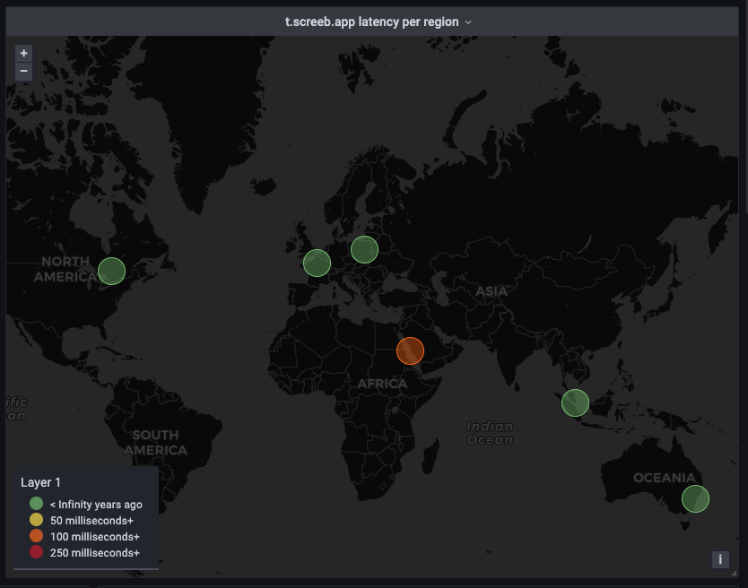

<h1 style="text-align: center;">
  Blackbox exporter
</h1>

## Wordwide probes

<a href="https://github.com/prometheus/blackbox_exporter" target="_blank">Blackbox Exporter</a> gives you the ability to probe endpoints over HTTP, HTTPS, DNS, TCP and ICMP.

You should deploy blackbox exporters in multiple Point of Presence around the globe, to monitor latency. Feel free to use the following endpoints for your own projects:

- https://screeb-probe-<b>montreal</b>.cleverapps.io
- https://screeb-probe-<b>paris</b>.cleverapps.io
- https://screeb-probe-<b>jeddah</b>.cleverapps.io
- https://screeb-probe-<b>singapore</b>.cleverapps.io
- https://screeb-probe-<b>sydney</b>.cleverapps.io
- https://screeb-probe-<b>warsaw</b>.cleverapps.io

☝️ Logs have been disabled. More probes from the community would be appreciated, please contribute <a href="https://github.com/samber/awesome-prometheus-alerts/" target="_blank">here</a>! These blackbox exporters use the following <a href="https://github.com/ScreebApp/blackbox_exporter/blob/master/screeb.yml" target="_blank">configuration</a>.

## Prometheus Configuration

Blackbox exporters and endpoints must be declared in Prometheus. Here is a simple configuration, inspired by [Hayk Davtyan medium post](https://medium.com/geekculture/single-prometheus-job-for-dozens-of-blackbox-exporters-2a7ba492d6c8):

```yml
# sd/blackbox.yml

- targets:
  #
  # Montreal
  #
  # http
  - screeb-probe-montreal.cleverapps.io:_:http_2xx:_:Montreal:_:f229cy:_:https://api.screeb.app
  - screeb-probe-montreal.cleverapps.io:_:http_2xx:_:Montreal:_:f229cy:_:https://t.screeb.app/tag.js
  # icmp
  - screeb-probe-montreal.cleverapps.io:_:icmp_ipv4:_:Montreal:_:f229cy:_:api.screeb.app
  - screeb-probe-montreal.cleverapps.io:_:icmp_ipv4:_:Montreal:_:f229cy:_:t.screeb.app


  #
  # Paris
  #
  # http
  - screeb-probe-paris.cleverapps.io:_:http_2xx:_:Paris:_:u09tgy:_:https://api.screeb.app
  - screeb-probe-paris.cleverapps.io:_:http_2xx:_:Paris:_:u09tgy:_:https://t.screeb.app/tag.js
  # icmp
  - screeb-probe-paris.cleverapps.io:_:icmp_ipv4:_:Paris:_:u09tgy:_:api.screeb.app
  - screeb-probe-paris.cleverapps.io:_:icmp_ipv4:_:Paris:_:u09tgy:_:t.screeb.app


  #
  # Sydney
  #
  # http
  - screeb-probe-sydney.cleverapps.io:_:http_2xx:_:Sydney:_:r3gpkn:_:https://api.screeb.app
  - screeb-probe-sydney.cleverapps.io:_:http_2xx:_:Sydney:_:r3gpkn:_:https://t.screeb.app/tag.js
  # icmp
  - screeb-probe-sydney.cleverapps.io:_:icmp_ipv4:_:Sydney:_:r3gpkn:_:api.screeb.app
  - screeb-probe-sydney.cleverapps.io:_:icmp_ipv4:_:Sydney:_:r3gpkn:_:t.screeb.app

  # ...
```

```yml
# prometheus.yml

global:
  # ...

scrape_configs:

  - job_name: 'blackbox'
    metrics_path: /probe
    scrape_interval: 30s
    scheme: https
    file_sd_configs:
      - files:
        - /etc/prometheus/sd/blackbox.yml
    relabel_configs:
      # adds "module" label in the final labelset
      - source_labels: [__address__]
        regex: '.*:_:(.*):_:.*:_:.*:_:.*'
        target_label: module
      # adds "geohash" label in the final labelset
      - source_labels: [__address__]
        regex: '.*:_:.*:_:.*:_:(.*):_:.*'
        target_label: geohash
      # rewrites "instance" label with corresponding URL
      - source_labels: [__address__]
        regex: '.*:_:.*:_:.*:_:.*:_:(.*)'
        target_label: instance
      # rewrites "pop" label with corresponding location name
      - source_labels: [__address__]
        regex: '.*:_:.*:_:(.*):_:.*:_:.*'
        target_label: pop
      # passes "module" parameter to Blackbox exporter
      - source_labels: [module]
        target_label: __param_module
      # passes "target" parameter to Blackbox exporter
      - source_labels: [instance]
        target_label: __param_target
      # the Blackbox exporter's real hostname:port
      - source_labels: [__address__]
        regex: '(.*):_:.*:_:.*:_:.*:_:.*'
        target_label: __address__

  # ...

```

## Geohash



To display nice maps in Grafana, you need to instruct blackbox exporters about the location. Grafana map panel speaks the "geohash" format:

- go to google map
- extract the lat/long from the url
- convert lat/long to geohash here: http://geohash.co

## Grafana

Some great dashboard have been created by the community: https://grafana.com/grafana/dashboards/?search=blackbox

Since Grafana v5.0.0, a map panel is available: https://grafana.com/docs/grafana/latest/panels-visualizations/visualizations/geomap/
